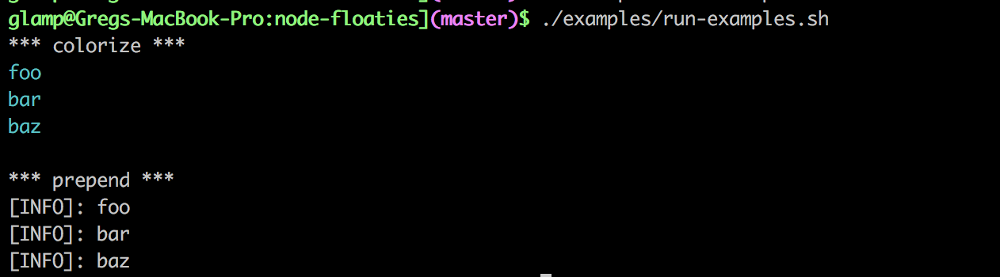

# floaties
Utilities for node.js streams.

<center>
    
</center>


## Usage

## install
```
npm install --save node-floaties
yarn add node-floaties
```

### colorize
```js
const floaties = require('node-floaties');
process.stdin.pipe(floaties.colorize()).pipe(process.stdout);
// output is blue
process.stdin.pipe(floaties.colorize({ color: 'green' })).pipe(process.stdout);
// output is green
```

### prepend
```js
const floaties = require('node-floaties');
process.stdin.pipe(floaties.prepend('[INFO]: ')).pipe(process.stdout);
// [INFO]: your text here
```


